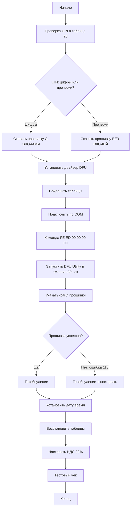

# Штрих-On-Line: обновление прошивки и замена ФН

## 1. Базовая информация

### 1.1. Загрузчик и прошивка

- **Загрузчик** + **Прошивка** — две части ПО ККТ.

- При включении ККТ сначала загружается загрузчик, проверяет прошивку и если все ок, то загружает ее, иначе сообщает об ошибках сигналами.
- Если есть проблемы с прошивкой, то загрузчик позволит загрузить новую через утилиту DFU
- Версия загрузчика читается в тест-драйвере:
  ```
  09. Параметры устройства → Загрузчик → Прочитать версию загрузчика
  ```
- Для DFU нужна версия загрузчика **≥131** (у большинства On-Line уже 133).

### 1.2. Версии прошивок (C.1, C.3 и т.д.)

Буква **«C»** — серия прошивок под новое ядро (NXP), а цифра после точки — вариант под конкретный ФФД и функционал.

| Версия  | ФФД  | Особенности                                         |
| ------- | ---- | --------------------------------------------------- |
| **C.1** | 1.05 | Без новых ставок НДС и маркировки (нет новых тегов) |
| **C.3** | 1.2  | С поддержкой маркировки (новые теги, другой формат) |

**Различие по ключам:**

- **С ключами** (`upd_app_…bin`) — для касс, где в таблице 23, поле 11 (UIN) указан **номер** (например, `400...`).
- **Без ключей** (`upd_app_for_old_frs…bin`) — для устройств с **прочерками** в UIN.

**Частые вопросы:**

- **Можно ли переходить с C.1 на C.3?** Да, если требуется ФФД 1.2.
- **Можно ли оставаться на C.1?** Да, если не нужна маркировка и новые сценарии, завязанные на ФФД 1.2.

**Где смотреть текущую версию:**

```
01. Состояние → Длинный запрос
Строки: "Версия ПО", "Дата ПО"
```

### 1.3. KKTLAB и POSCenter

Это две разные компании, выросшие из ГК "ШТРИХ-М"

ООО «ККТЛаб» - формально центр компетенций по ККТ ГК «ШТРИХ‑М», который взял на себя поддержку всего модельного ряда Штрих‑М.

Делают свои прошивки и свой драйвер, но под штриховский протокол и под старый парк Штрих‑М.

ООО «Посцентр» создана командой, вышедшей из проектного отдела «Штрих‑М» в 2017 году.
​
Делает собственные кассы POScenter/Ритейл и свои прошивки/драйвера, тоже на основе того же протокола Штрих‑М, чтобы старый софт можно было использовать без переделки.

### 1.4. Таблицы и ключевые данные

**Где находятся таблицы:**

```
Тест-драйвер → Кнопка "Таблицы…"
```

**Ключевые таблицы:**

| №      | Название             | Что в ней                                |
| ------ | -------------------- | ---------------------------------------- |
| **1**  | Тип и режим кассы    | Базовая конфигурация                     |
| **5**  | Налоговые ставки     | НДС 22%, 0%, без НДС и т.д.              |
| **23** | Удалённый мониторинг | Поле 11: `Uin (ro)` — номер или прочерки |

**Сохранение таблиц перед прошивкой:**

```
Таблицы → Импорт/Экспорт → Экспорт всех таблиц → Сохранить файл
```

**Восстановление после прошивки:**

```
Таблицы → Импорт/Экспорт → Импорт таблиц → Указать файл
```

### 1.5. DFU-режим

DFU - режим загрузки обновлений.

**Два способа перевода в DFU:**

1. **Аппаратный (джампер, для тяжелых случаев, не рекомендуется):**
   - Вскрыть корпус, переставить джампер на плате.

2. **Программный (команда FE ED, рекомендуется):**

   ```
   12. Прочее → Команда → HEX-команда: FE ED 00 00 00 00 → Выполнить
   ```

   - Касса перезагружается.
   - В диспетчере устройств появляется **DFU-устройство**.
   - В течение 30 секунд запустить DFU Utility.

В дальнейшем касса будет нормально шиться из тест-драйвера

### 1.6. SD-карты

- На большинстве Штрих-On-Line **слот microSD не распаян** (есть только контактная площадка).
- Прошивка с SD-карты **невозможна**.

### 1.7. Лицензии и как прошивка работает без них

**Лицензия:**

- Название: **«Штрих-М: Сервис обновления ФР. Единая подписка»**
- Привязка: к заводскому номеру ККТ
- Назначение: право использовать новые возможности (НДС 22%, новые ФФД)

**Где посмотреть:**

```
Тест-драйвер KKTLAB → Вкладка "Лицензии ККТ"
```

**Как записать:**

```
Лицензии ККТ → Указать файл/код от поставщика → Записать в ККТ → Распечатать тестовый чек
```

**Работа без лицензии:**
Без лицензии новые прошвки не работают совсем.  
Если нет нужных лицензий, то касса при включении и попытке открыть смену будет печатать ошибку на ленте.

---

## 2. Прошивка

**Если установка прошивки привела к кирпичу - ничего страшного, всегда можно залить новую через DFU-утилиту**
**Если установка загрузчика привела к крипичу - нужно либо шить новый через SD-карту, либо через программатор.**

Так как у ШТРИХ-ON-LINE не распаян разъем для SD-карты, при неудачном обновлении загрузчика придется ехать в ЦТО.

### 2.1. Предварительные проверки на ККТ

#### Версия загрузчика

```
09. Параметры устройства → Загрузчик → Прочитать версию загрузчика
```

- **Версия <131** — DFU может не поддерживаться, нужен XMODEM.
- **Версия ≥131** (например, 133) — DFU работает.

#### Проверка UIN (определение типа прошивки)

```
Таблицы → Таблица 23 "Удалённый мониторинг и администрирование" → Поле 11: Uin (ro)
```

**Варианты:**

| Значение UIN                 | Нужная прошивка | Файл                       |
| ---------------------------- | --------------- | -------------------------- |
| **Прочерки (`---`)**         | Без ключей      | `upd_app_for_old_frs_…bin` |
| **Цифры (например, `400…`)** | С ключами       | `upd_app_…bin`             |

#### Сохранение таблиц

```
Таблицы → Импорт/Экспорт → Экспорт всех таблиц → Сохранить файл (например, tables_backup.bin)
```

Это страховка — после прошивки, если что-то слетит в настройках, можно их восстановить.

---

### 2.2. Установка софта

**ВНИМАНИЕ!" НАЧИНАЯ С 2026 ГОДА ПРОШИВКИ В ОТКРЫТЫЙ ДОСТУП НЕ ВЫКЛАДЫВАЮТСЯ! ПРОСИМ У АСЦ, ГДЕ ПРИОБРЕТАЛИ ЛИЦЕНЗИЮ (ЕДИНУЮ ПОДПИСКУ)**

#### Список файлов для скачивания:

**Можно скачать здесь:** [https://shtrih-m-nsk.ru/technical-library/drayvera-i-proshivki-dlya-on-line-kkm/](https://shtrih-m-nsk.ru/technical-library/drayvera-i-proshivki-dlya-on-line-kkm/)

| Файл                                                                                                                                    | Размер |
| --------------------------------------------------------------------------------------------------------------------------------------- | ------ |
| [**Тест-драйвер KKT**](https://shtrih-m-nsk.ru/upload/iblock/d8d/5lf8un147l0kg1b1ssatfxhhcdhvh8o6/Poscenter_DrvKKT_5.21.0.1211_x32.zip) | ~30 МБ |
| [**Драйвер DFU для Windows 7/8/8.1/10**](https://shtrih-m-nsk.ru/upload/iblock/4a7/dfu.zip)                                             | ~5 МБ  |
| [**DFU Utility**](https://shtrih-m-nsk.ru/upload/iblock/fef/dfu_utilyti.zip)                                                            | ~15 МБ |

### 2.3. Перевод в DFU

```
Тест-драйвер → 12. Прочее → Вкладка "Команда"
Поле "Команда HEX": FE ED 00 00 00 00
Нажимаем "Передать"
```

**Что происходит:**

- Касса перезагружается.
- Загорается **красный индикатор**.
- В **Диспетчере устройств Windows** появляется **DFU-устройство** (раздел "Универсальная последовательная шина USB" или "Другие устройства").

> ⏱️ **Важно:** После перевода в DFU режим касса остаётся в этом состоянии **30 секунд**. Успеваем запустить DFU Utility!

#### Шаг 3: Проверка в диспетчере устройств

```
Диспетчер устройств → Универсальная последовательная шина USB
Должно появиться: "STM32 BOOTLOADER" или "DFU in FS Mode"
```

Если устройство не распознано — переустанавливаем драйвер DFU.

---

### 2.4. Прошивка через DFU Utility

#### Подготовка

#### Запуск прошивки

```bash
# В папке DFU Utility находим и запускаем:
"Прошивка через DFU.bat"
```

### 2.5. Что делать при ошибке 116 «Ошибка ОЗУ»

#### Причины:

| Причина                        | Решение                                                  |
| ------------------------------ | -------------------------------------------------------- |
| **Неправильный файл прошивки** | Проверяем UIN (см. п. 2.1, шаг 3), скачиваем верный файл |
| **Нужно техобнуление**         | Выполняем технологическое обнуление (см. ниже)           |

#### Алгоритм устранения:

**Технологическое обнуление**

```
10. Сервис → Вкладка "Обнуление" → Технологическое обнуление
Дожидаемся: (0) Ошибок нет
```

**Установка даты и времени**

```
10. Сервис → Вкладка "Дата и время"
Устанавливаем текущие дату и время
⚠️ В кассе должна быть бумага (иначе ошибка 107)
```

**Перезагрузка**

```
Выключаем кассу (тумблер или питание)
Ждём 5 секунд
Включаем снова
```

**Повторная прошивка**

Используем DFU Utility - она обходит проверки ОЗУ и шьёт напрямую в контроллер

```
Копируем файл прошивки в папку DFU и переименовываем в `upd_app.bin` (где лежат `.bat` и `.exe` файлы).
```

#### Если ошибка остаётся:

1. Убеждаемся, что используем **правильный файл** (с ключами / без ключей).
2. Проверяем **физическое подключение** ФП (шлейфы, контакты).
3. Если всё проверено — **аппаратная проблема RAM** → сервисный центр.

---

### 2.6. Обнуление и восстановление после прошивки

#### Проверка успешной прошивки

```
01. Состояние → Длинный запрос
Проверяем:
- Версия ПО: C.1
- Дата ПО: 24.12.2025
```

Если версия и дата корректны — прошивка успешна.

#### Технологическое обнуление (обязательно)

```
10. Сервис → Обнуление → Технологическое обнуление
Результат: (0) Ошибок нет
```

#### Установка даты и времени

```
10. Сервис → Дата и время
Устанавливаем текущие дату и время
⚠️ Бумага должна быть в кассе
```

#### Восстановление таблиц (опционально)

Если сохранял таблицы перед прошивкой:

```
Таблицы → Импорт/Экспорт → Импорт таблиц → Указать файл tables_backup.bin
```

Это вернёт:

- Форматы чеков
- Тексты заголовков/подвалов
- Настройки отделов
- Прочие параметры

#### Настройка НДС 22%

```
Таблицы → Таблица 5 "Налоговые ставки"
Ставка №11 или 1: 22 (НДС 22%)
Остальные: 0 (НДС 0%), 6 (без НДС) и т.д. по схеме
Сохранить изменения
```

---

## 3. Замена ФН

**ВНИМАНИЕ! НИ НА ОДНОМ ЭТАПЕ НЕ НУЖНО ВВОДИТЬ ДАННЫЕ ВРУЧНУЮ!**  
**ВСЕ МОЖНО СОХРАНИТЬ ИЛИ ЗАПОЛНИТЬ!**  
**ОТЧЕТЫ О ЗАКРЫТИИ И РЕГИСТАРЦИИ ОБЯЗАТЕЛЬНО СОХРАНИТЬ ЧЕРЕЗ ТЕСТ-ДРАЙВЕР!**

[Инструкция по замене ФН](https://tensor.ru/cto/zamena_fn_shtrih)  
[инструкция по перерегистрации на сайти ИФНС](https://saby.ru/help/ofd/setting/rereg/fns)

#### Закрытие старого ФН

```
Если старый ФН работает:
1. Закрываем смену (Z-отчёт)
2. Распечатываем X-отчёт и отчёт о состоянии расчётов (для архива)
3. Делаем архив ФН (02. ФН сервис → Архив ФН → Прочитать и сохранить архив ФН в файл)
4. Закрываем ФН (02. ФН сервис → Закрытие ФН)
5. Дожидаемся отправки всех ФД в ОФД
```

#### Физическая замена ФН

```
1. Выключаем кассу, вынимаем питание
2. Откручиваем 4 винта снизу (крышка отсека ФН)
3. Вынимаем старый ФН (аккуратно, не повреждаем разъём)
4. Вставляем новый ФН до упора (по ключу разъёма)
5. Закрываем крышку, закручиваем винты
6. Включаем питание
```

#### Активация нового ФН

```
02. ФН сервис → Проверка ФН
Статус должен быть: "Новый (не активирован)"

02. ФН сервис → Фискализация (открытие ФН)
Заполняем:
- ИНН организации
- Наименование организации / ИП
- Адрес расчётов
- Режим работы (автономный / с ОФД)
- Признак ККТ (интернет-магазин и т.д.)

Подтверждаем → Дожидаемся печати отчёта об открытии смены
```

#### Регистрация в ФНС

```
1. Заходим в личный кабинет ФНС (lkk.nalog.ru)
2. Перерегистрируем ККТ с новым номером ФН
3. Получаем регистрационный номер
4. Распечатываем отчёт о регистрации ККТ
```

#### Лицензия (когда придёт)

```
Тест-драйвер KKTLAB → Лицензии ККТ
Указываем файл лицензии или вводим код
Записываем в ККТ
Распечатываем тестовый чек → Проверяем отсутствие сообщений об ограничениях
```

---

## 4. Полезные ссылки

| Ресурс                                         | Ссылка                                                                                                                                                               |
| ---------------------------------------------- | -------------------------------------------------------------------------------------------------------------------------------------------------------------------- |
| **Техническая библиотека Штрих-М Новосибирск** | [https://shtrih-m-nsk.ru/technical-library/drayvera-i-proshivki-dlya-on-line-kkm/](https://shtrih-m-nsk.ru/technical-library/drayvera-i-proshivki-dlya-on-line-kkm/) |
| **Официальный сайт Штрих-М**                   | [https://www.shtrih-m.ru/](https://www.shtrih-m.ru/)                                                                                                                 |
| **Проверка ФН на сайте ФНС**                   | [https://kkt-online.nalog.ru/](https://kkt-online.nalog.ru/)                                                                                                         |
| **Личный кабинет ФНС**                         | [https://lkk.nalog.ru/](https://lkk.nalog.ru/)                                                                                                                       |
| **Поддержка Штрих-М**                          | support@shtrih-m.ru                                                                                                                                                  |

---

## 5. Troubleshooting

### Проблема: Касса не переходит в DFU-режим

**Симптомы:**

- После команды `FE ED 00 00 00 00` касса не перезагружается.
- В диспетчере устройств нет DFU-устройства.

**Решения:**

1. **Проверяем версию загрузчика:**

   ```
   09. Параметры устройства → Загрузчик → Прочитать версию
   Если <131 → используй XMODEM вместо DFU
   ```

2. **Переустанови драйвер DFU:**

   ```
   Диспетчер устройств → Находим неопознанное устройство
   Обновляем драйвер → Указываем путь к драйверу DFU
   ```

3. **Пробуем другой USB-порт:**
   - Используем порт **USB 2.0** (не 3.0).
   - Подключаем напрямую к материнской плате (не через хаб).

4. **Аппаратный перевод через джампер:**
   - Вскрываем корпус, найди джампер DFU на плате.
   - Переставь в режим DFU согласно документации.

---

### Проблема: DFU Utility не видит устройство

**Симптомы:**

- DFU Utility запущена, но пишет "Device not found".

**Решения:**

1. **Убеждаемся, что касса в DFU-режиме:**

   ```
   Диспетчер устройств → Должно быть "STM32 BOOTLOADER"
   ```

2. **Запускаем DFU Utility в течение 30 секунд:**
   - После команды `FE ED` у нас ограниченное время.
   - Подготавливаем DFU Utility заранее, файл прошивки в папке.

3. **Переустанови драйвер DFU:**
   ```
   Удаляем старый драйвер
   Устанавливаем заново
   Перезагружаем ПК
   ```

---

### Проблема: Ошибка 116 даже с правильным файлом

**Симптомы:**

- UIN проверен, файл правильный (с ключами / без ключей).
- После техобнуления ошибка 116 остаётся.

**Решения:**

1. **Проверяем шлейф печатающей головки:**

   ```
   Выключаем кассу
   Вскрываем корпус
   Переподключаем шлейф ФП (аккуратно, без повреждений)
   Включаем кассу
   ```

2. **Пробуем XMODEM вместо DFU:**

   ```
   Прошивка по COM-порту
   Медленнее, но надёжнее при проблемах с памятью
   ```

3. **Обращаемся в сервис:**
   - Если все варианты испробованы — аппаратная проблема RAM.
   - Нужна замена платы или модуля памяти.

---

### Проблема: После прошивки касса не печатает

**Симптомы:**

- Прошивка прошла успешно (версия C.1).
- Но касса не печатает чеки (бумага не движется).

**Решения:**

1. **Ошибка 107 (нет бумаги):**

   ```
   Проверяем установку рулона
   Датчик бумаги может быть загрязнён → протираем
   ```

2. **Проверяем настройки печати:**

   ```
   Таблицы → Таблица 1 → Параметры печати
   Скорость печати, контрастность и т.д.
   ```

3. **Восстанови таблицы из бэкапа:**
   ```
   Импорт таблиц → Указываем файл, сохранённый до прошивки
   ```

---

### Проблема: Лицензия не записывается

**Симптомы:**

- Вкладка "Лицензии ККТ" не активна или выдаёт ошибку.

**Решения:**

1. **Обновляем тест-драйвер:**
   - Используем **KKTLAB** версию, не старую.
   - Скачиваем последнюю с сайта Штрих-М.

2. **Проверяем формат лицензии:**

   ```
   Должен быть файл .lic или текстовый код
   Убеждаемся, что лицензия для нашего заводского номера
   ```

3. **Перезагружаем кассу после записи:**
   ```
   Записываем лицензию → Выключаем кассу → Включаем → Проверяем снова
   ```

---

### Проблема: НДС 22% не отображается в чеке

**Симптомы:**

- Прошивка C.1 установлена.
- В таблице 5 НДС 22% прописан.
- Но в чеке показывает старую ставку (20%) или "без НДС".

**Решения:**

1. **Проверяем настройки в учётной системе (1С):**

   ```
   1С УТ/УПП/Розница → Настройка ККТ
   Код ставки НДС → Должен соответствовать таблице 5 (обычно №1)
   ```

2. **Пересохраняем товары с новой ставкой:**

   ```
   В справочнике товаров обновляем ставку НДС на 22%
   Проводим документы заново
   ```

3. **Тестовый чек напрямую через тест-драйвер:**
   ```
   04. Тестовые чеки → Указать ставку №1 (22%)
   Если в тестовом чеке НДС 22% есть → проблема в 1С
   Если нет → проверь таблицу 5 ещё раз
   ```

---

## 📝 Чек-лист перед прошивкой

- [ ] Узнал текущую версию ПО (01. Состояние → Длинный запрос)
- [ ] Проверил версию загрузчика (09. Параметры устройства → Загрузчик)
- [ ] Определил UIN (таблица 23, поле 11) → выбрал правильный файл прошивки
- [ ] Сохранил таблицы (Импорт/Экспорт → Экспорт всех таблиц)
- [ ] Скачал тест-драйвер KKTLAB, прошивку C.1, драйвер DFU, DFU Utility
- [ ] Установил драйвера
- [ ] Подключил кассу по COM, установил связь
- [ ] Перевёл в DFU командой `FE ED 00 00 00 00`
- [ ] Запустил DFU Utility, указал файл прошивки
- [ ] Дождался завершения (касса перезагрузилась)
- [ ] Проверил версию ПО (должна быть C.1, дата 24.12.2025)
- [ ] Сделал технологическое обнуление
- [ ] Установил дату и время
- [ ] Восстановил таблицы (если нужно)
- [ ] Настроил НДС 22% (таблица 5)
- [ ] Пробил тестовый чек, убедился что НДС 22% отображается
- [ ] Распечатал X-отчёт

---

## 🎯 Итоговая схема действий


